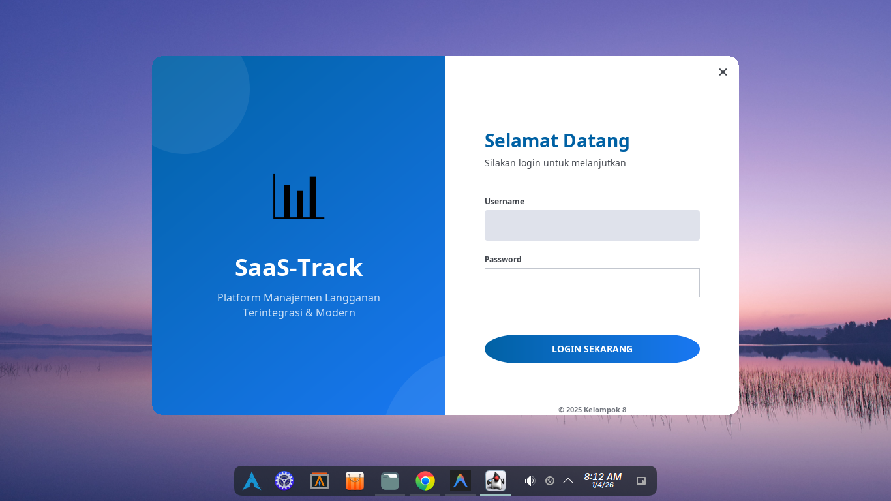
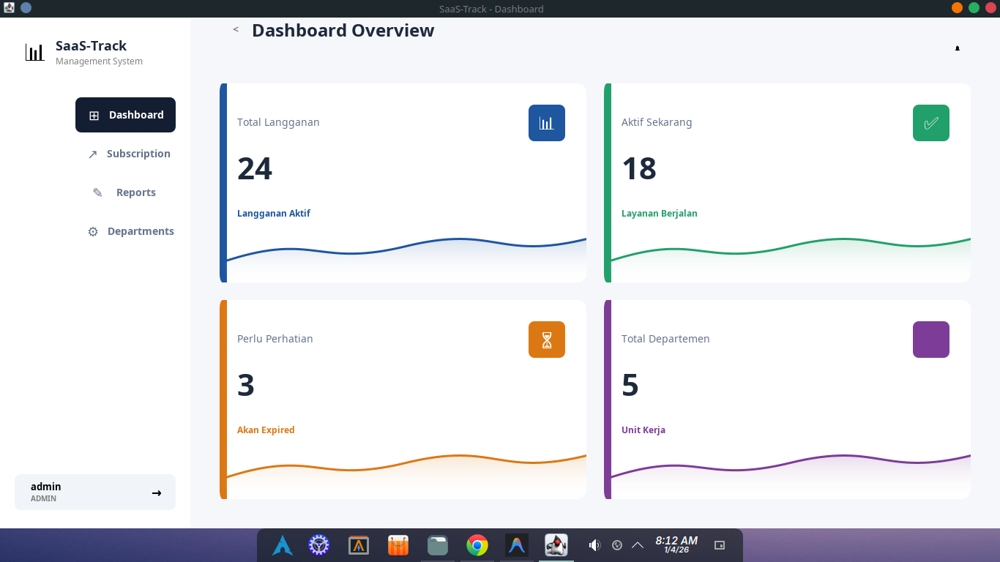
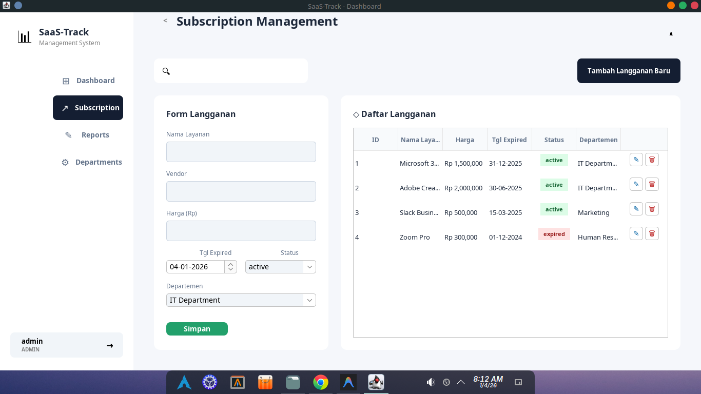
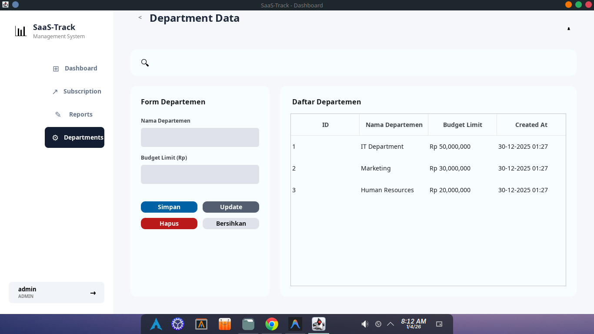
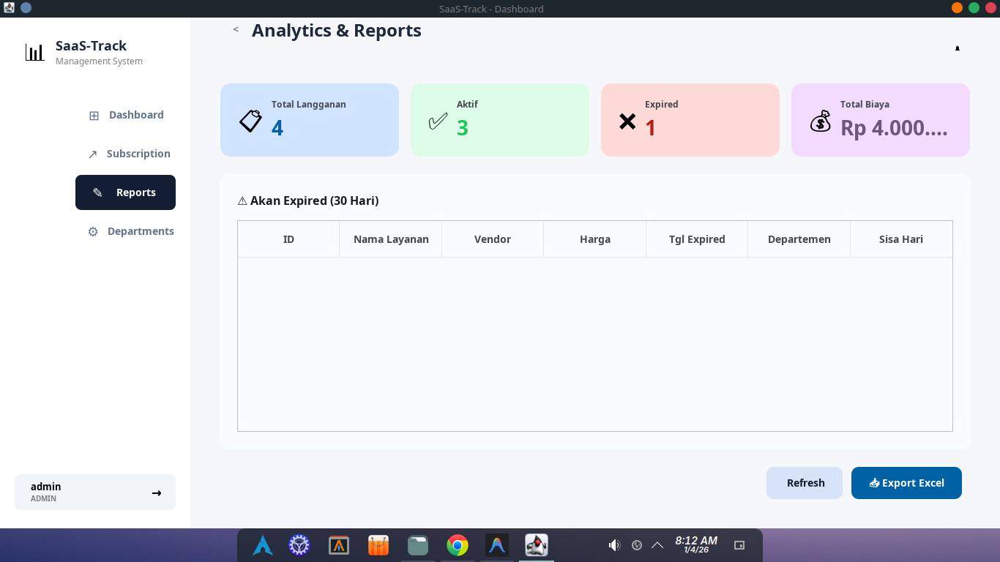

# SaaS-Track

**Platform Manajemen Langganan SaaS Terintegrasi & Modern**

Aplikasi desktop berbasis Java Swing untuk mengelola langganan SaaS (Software as a Service) per departemen dalam organisasi.

## 📸 Screenshots

### Login


### Dashboard & Subscription



### Departments & Reports



---

## 📋 Fitur

- Dashboard dengan statistik langganan
- CRUD Langganan (Subscriptions)
- Manajemen Departemen
- Laporan & Analitik
- **Export Report ke PDF, HTML, dan Excel (BIRT)**
- Otentikasi User (Admin/Operator)
- UI Modern dengan Material Design 3

## 🛠️ Prasyarat

- **Java JDK 17+** 
- **MySQL 8.0+** atau **MariaDB**
- **Git**

## 📥 Clone Repository

```bash
git clone https://github.com/Gustyx-Power/SaaS-Track.git
cd SaaS-Track
```

---

## 🚀 Quick Install (Otomatis)

### 🐧 Linux

Pilih sesuai distro Anda:

#### Ubuntu / Debian
```bash
sudo ./ubuntu-deb-dependencies-install.sh
```

#### Arch Linux
```bash
sudo ./arch-dependencies-install.sh
```

#### Fedora / RHEL / CentOS
```bash
sudo ./fedora-rhel-dependencies-install.sh
```

### 🪟 Windows

Jalankan PowerShell sebagai **Administrator**:
```powershell
Set-ExecutionPolicy Bypass -Scope Process -Force
.\windows-dependencies-install.ps1
```

> **Note:** Script akan otomatis menginstall Chocolatey, Java 17, MySQL, dan setup database.

---

## 🔧 Manual Setup (Opsional)

### 1. Login ke MySQL
```bash
mysql -u root -p
```

### 2. Buat User Database
```sql
CREATE USER 'saastrack'@'localhost' IDENTIFIED BY 'saastrack123';
GRANT ALL PRIVILEGES ON db_saas_track.* TO 'saastrack'@'localhost';
FLUSH PRIVILEGES;
```

### 3. Import Database
```bash
mysql -u saastrack -p < sql/db_saas_track.sql
```

### 4. Verifikasi
```sql
USE db_saas_track;
SHOW TABLES;
```

---

## ▶️ Menjalankan Aplikasi

### 🐧 Linux / macOS
```bash
chmod +x linux-run.sh    # Berikan permission (sekali saja)
./linux-run.sh
```

### 🪟 Windows
Double-click `windows-run.bat` atau jalankan di Command Prompt:
```cmd
windows-run.bat
```

> **Note:** Script sudah menyertakan JVM flags untuk kompatibilitas Java 17+ dengan BIRT Report Engine.

---

## 🔐 Akun Default

| Username   | Password      | Role     |
|------------|---------------|----------|
| admin      | admin123      | Admin    |
| operator1  | operator123   | Operator |

---

## 📊 Export Report

Aplikasi mendukung export laporan dalam 3 format:

| Format | Deskripsi |
|--------|-----------|
| 📄 PDF | Menggunakan BIRT Report Engine |
| 🌐 HTML | Export ke file HTML |
| 📥 Excel | Menggunakan Apache POI |

**Cara penggunaan:**
1. Masuk ke menu **Reports**
2. Klik tombol export yang diinginkan
3. Pilih lokasi penyimpanan file

---

## 📁 Struktur Proyek

```
SaaS-Track/
├── src/
│   ├── model/          # Entity classes
│   ├── view/           # UI components (Swing)
│   ├── dao/            # Data Access Objects
│   ├── util/           # Utilities (Theme, DB, BIRT)
│   └── Main.java       # Entry point
├── lib/                # JAR dependencies
│   └── birt/           # BIRT Report Engine (93 JARs)
├── report/
│   └── subscription_report.rptdesign
├── sql/
│   └── db_saas_track.sql
├── linux-run.sh                        # Linux/macOS run script
├── windows-run.bat                     # Windows run script
├── ubuntu-deb-dependencies-install.sh  # Ubuntu/Debian installer
├── arch-dependencies-install.sh        # Arch Linux installer
├── fedora-rhel-dependencies-install.sh # Fedora/RHEL installer
└── windows-dependencies-install.ps1    # Windows installer
```

---

## 📚 Dependencies

- FlatLaf 3.4 (Modern Look and Feel)
- MySQL Connector/J 8.2.0
- Apache POI 5.2.5 (Excel export)
- **BIRT Report Engine 4.18.0** (PDF & HTML export)

---

## 📄 License

© 2025 Kelompok 8
